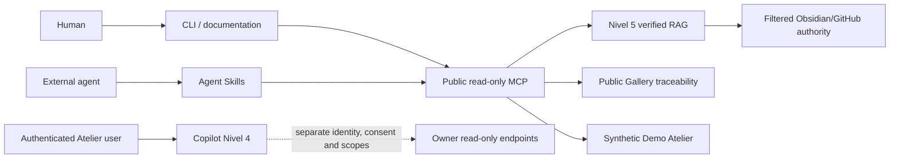

# Public Agentic Architecture

Tokenizart Agentic is the public client and verification layer for the hosted
Tokenizart ecosystem.

## Boundaries

- Public tools expose Nivel 5 verified knowledge and public traceability only.
- Copilot Nivel 4 is a separate authenticated surface.
- The Demo uses synthetic fixtures and never calls live owner services.
- Obsidian and private repositories remain the editorial and implementation
  authority; OKF and RAG are derived distributions.
- Hosted execution remains proprietary and is not reproduced by this repo.

The current MCP server metadata is in `mcp/server.preview.json`. It is not an
MCP Registry publication manifest.

