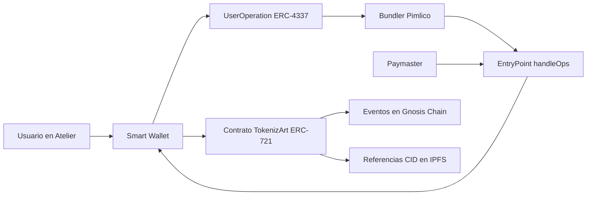

# TokenizArt Smart Contract, Mint, Certify y ERC-4337

## Respuesta canonica breve

Tokenizart registra en Gnosis Chain la identidad digital y hechos relevantes de
obras u objetos fisicos unicos. Su contrato publico `TokenizArt` usa ERC-721:
cada Mint crea un `Token ID` unico dentro del contrato y asocia un CID de IPFS
con la metadata de la obra. Certify no crea otro NFT ni transfiere la obra;
agrega a ese Token ID una referencia IPFS atribuida a la wallet certificadora.

Atelier oculta buena parte de esta mecanica. La Smart Wallet autoriza la
operacion; una infraestructura ERC-4337 puede agruparla y un paymaster puede
subvencionar el gas. Por eso el usuario puede concentrarse en la obra, la
evidencia y la trazabilidad en vez de comprar xDai o enviar transacciones
manualmente.

## Las capas no deben confundirse

| Capa | Funcion |
| --- | --- |
| Atelier | Interfaz donde el usuario carga, revisa y autoriza acciones. |
| Voucher | Credito operativo de Tokenizart que habilita una accion de producto. No es cripto ni gas. |
| Smart Wallet | Cuenta inteligente que valida y ejecuta la operacion autorizada. |
| ERC-4337 | Protocolo que transporta una `UserOperation` mediante bundler, EntryPoint y, cuando corresponde, paymaster. |
| Pimlico | Proveedor observado de bundler/paymaster; no es el NFT ni la wallet del usuario. |
| TokenizArt ERC-721 | Contrato publico que crea Token IDs, conserva titularidad y registra CIDs de Certify. |
| IPFS | Capa de archivos y metadata identificados por CID. |
| Gnosis Chain | Red publica donde quedan las transacciones y eventos verificables. |
| Blockscout | Explorador/API de lectura; no ejecuta Mint ni Certify. |

## Como funciona Mint

1. La obra se carga y revisa en Atelier.
2. El usuario autoriza Mint desde su Smart Wallet.
3. La operacion ERC-4337 llega al contrato `TokenizArt`.
4. El contrato toma el siguiente contador `totalSupply` como Token ID y lo
   incrementa. Los IDs comienzan en `0`.
5. El ERC-721 se crea para la direccion indicada.
6. El contrato guarda el CID de metadata como `tokenURI` bajo su base IPFS.
7. La transaccion emite el evento ERC-721 `Transfer` desde la direccion cero y
   el evento propio `Mint(sender, id, to, ipfsCode)`.

El Token ID es unico dentro de este contrato. No significa que blockchain
conozca por si sola el nombre, email o identidad civil de una persona: esa
relacion se gestiona en la capa de Atelier y sus controles de identidad.

## Como funciona Certify

1. El actor pertinente prepara una declaracion o evidencia en Atelier.
2. La documentacion se referencia mediante IPFS.
3. La Smart Wallet autorizada llama `certify(tokenId, cid)`.
4. El contrato agrega el CID a la lista del par `Token ID + wallet
   certificadora`.
5. Emite `Certify(sender, id, certifier, ipfsCode)`.

Certify no cambia `ownerOf`, no cambia el Token ID y no reemplaza la metadata
principal del NFT. Suma una referencia verificable a la historia de la obra.
La atribucion tecnica es una direccion de wallet; la identidad profesional o
humana que Atelier muestre requiere su propia relacion verificada fuera del
contrato.

## Caso publico verificado: obra 313 / Token ID 662

La obra publica `Circus`, atribuida en Atelier a Alfredo Prior, aparece como
obra 313 y Token ID 662.

- contrato: `0x9F78e7a5a9adFb097CF36Ab0c2D86aeE011Ab81e`;
- estandar: ERC-721;
- Token ID: `662`;
- Mint: `0x0c19088fee52554d2f586934660ee75791013351cbef30ded392076b923719e5`;
- CID de metadata: `QmSU9fGffXwc4gHAJz4vqmDy9miaMnfvxupTVfDNEzNPT6`;
- CID de imagen: `QmXxMyHvfS6dzbuMFE8nLv5aSQARMBSW7dQUYQJtQNRD6p`;
- Certify visible: `Poliza de seguros`;
- transaccion Certify: `0x1d21b7ebae69d2be0a54995ea25907feb5635d4cc74faac83b3a72d7b0d60519`;
- CID raiz de Certify: `QmRWvVQG6VZWDsgLNUkjKN815EpYYDzo1g1o8H5xE25yTh`.

El JSON raiz de esa Certify contiene un `artworkHash` igual al CID de metadata
del Mint y una lista `certificationHashes`. Esa igualdad es el vinculo
documental explicito entre el paquete Certify y la metadata de la obra.

## Que se observo sobre ERC-4337 y la subvencion de gas

En el Mint 662 y su Certify se verifico este recorrido:

Las dos operaciones emitieron `UserOperationEvent` con `success=true` y un
evento de patrocinio del paymaster con `tokenAmountPaid=0`. La Smart Wallet
observada no necesitaba saldo xDai para pagar directamente esas operaciones.
Eso no significa que el gas desaparezca: el costo de red existe, pero el
paymaster lo cubre dentro del flujo patrocinado.

Las direcciones de bundler pueden cambiar entre transacciones. No debe
presentarse una direccion de bundler como si fuera la wallet del usuario, el
contrato de Tokenizart o una identidad permanente.

## Vouchers y gas

- Voucher Mint: habilita el flujo de Mint en la aplicacion.
- Voucher Certify: habilita la accion Certify del actor ejecutante.
- Voucher NFC: habilita el flujo de vinculacion correspondiente.
- Transferencia: no consume voucher segun la regla curada vigente.
- Gas: costo tecnico de la red, separado de los vouchers.

La blockchain publica no conoce el saldo de vouchers ni aplica por si sola la
politica comercial de Atelier. Esa politica se valida en backend/aplicacion.

## Que prueba y que no prueba

La evidencia on-chain permite verificar que una direccion ejecuto una llamada,
que el contrato emitio un evento, que un Token ID existe, que se referencio un
CID y que la transaccion tuvo un resultado determinado.

No demuestra por si sola:

- autenticidad absoluta de la obra;
- identidad civil de quien controla una wallet;
- veracidad material de todo archivo cargado;
- transferencia automatica de derechos de autor, licencias o posesion fisica;
- precio, liquidez o rentabilidad;
- disponibilidad perpetua de un gateway IPFS concreto.

Tokenizart aporta mas valor cuando la evidencia es pertinente, atribuible y
acumulativa, y cuando distintos actores documentan hechos con responsabilidad.

## Fuentes publicas verificadas

- https://atelier.tokenizart.com/?artwork=313
- https://gnosis.blockscout.com/token/0x9F78e7a5a9adFb097CF36Ab0c2D86aeE011Ab81e/instance/662
- https://gnosis.blockscout.com/tx/0x0c19088fee52554d2f586934660ee75791013351cbef30ded392076b923719e5
- https://gnosis.blockscout.com/tx/0x1d21b7ebae69d2be0a54995ea25907feb5635d4cc74faac83b3a72d7b0d60519
- https://gnosis.blockscout.com/address/0x9F78e7a5a9adFb097CF36Ab0c2D86aeE011Ab81e?tab=contract
- https://eips.ethereum.org/EIPS/eip-4337
- https://docs.gnosischain.com/about/networks/mainnet
- https://docs.pimlico.io/
